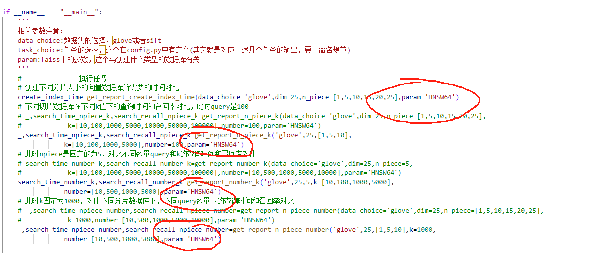
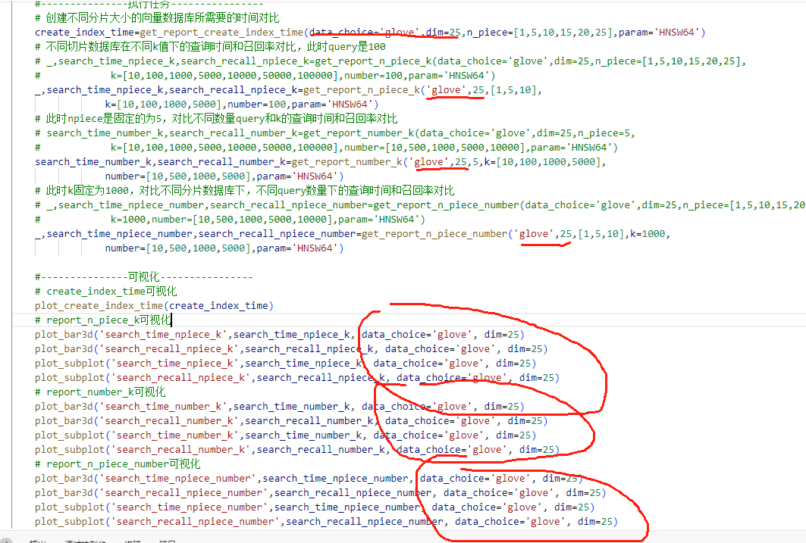

# 介绍

这是关于faiss向量数据库测试的相关代码，使用的数据集是glove-25和sift-128,数据来源[erikbern/ann-benchmarks: Benchmarks of approximate nearest neighbor libraries in Python (github.com)](https://github.com/erikbern/ann-benchmarks)

支持的测试内容：

- [x] 支持HNSW64,其余的还没测试
- [ ] 支持创建faiss数据库的不同参数测试
- [x] 创建不同分片向量数据库的时间对比
- [x] 不同切片数据库在不同k（top k）值下的查询时间和召回率对比
- [x] 对比不同query数量下的查询时间和召回率对比
- [x] 对比不同分片数据库下，不同query数量下的查询时间和召回率对比
- [ ] QPS-Recall测试
  - [ ] HNSW的测试


# 使用说明

1. 安装相关环境，`conda create -n faiss-test python=3.9`,`pip install -r requirements.txt`

2. 如果仅使用HNSW 64，直接在faiss-test环境下运行`python faiss_get_report.py`

3. `data_use.ipynb`这个文件主要是测试方便，所有的函数都是先在这个文件上测试后再使用，直接用vscode全部运行等个10来分钟就差不多了。这里面的代码比较杂乱。

4. 如果想要修改创建数据库的类型，可以修改`faiss_get_report.py`下的

   1. 

5. 创建数据库的相关文件是`faiss_database_create.py`创建的方式采用的是`faiss.index_factory(dim, param, measure)`具体可看

   1. [The index factory · facebookresearch/faiss Wiki (github.com)](https://github.com/facebookresearch/faiss/wiki/The-index-factory)

6. `faiss_test.py`主要是用来获取Recall，可以看数据是如何召回的

   1. 如果想要修改数据集，注意需要修改`faiss_get_report.py`下的`data_choice`和`dim`参数，这两个参数要与`config.py`中的字典`data_info`中信息匹配

   2. 

      ```python
      data_info={
          'glove':{25:'glove-25-angular',
                 50: 'glove-50-angular',
                 100: 'glove-100-angular',
                 200: 'glove-200-angular'},
          'sift':{128:'sift-128-euclidean'}
      }
      ```

      

7. 最后输出的结果是一组图片，存放在figure文件夹中，index文件夹存的是向量数据库

8. 这里还有关于faiss的一些个人学习资料，具体可看同文件夹下的：`Faiss-HNSW.md`

# 文件修改说明

1. `faiss_get_report2.py`
   1. 这里相对于`faiss_get_report.py`将子图那一块修改了，直接观察子图不方便对比，这边将子图换成了在一个图中画多条折线图。`config.py`没有修改，关于多折线图依然对应`set_xlabel,set_ylabel`
2. 由于`faiss.IndexIDMap`有一定的bug，我们不采用该方法，修改了`faiss_test.py`中的`get_search_result`函数，并添加了`get_id`函数。同时修改了`faiss_database_create.py`中的`data_piece`函数和`create_index`函数
